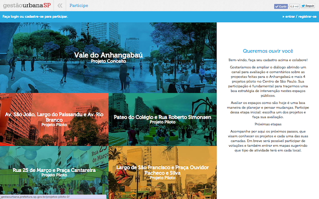
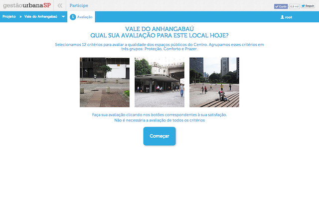
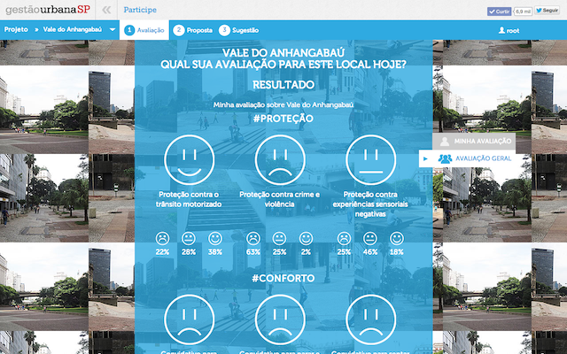
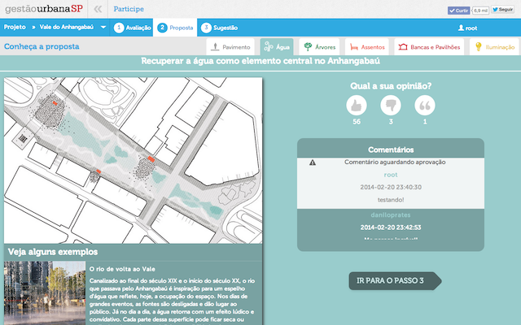
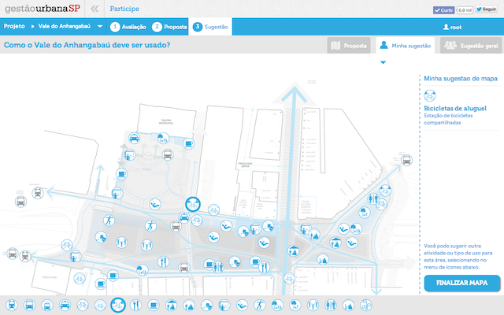

# Centro Diálogo Aberto - Participe

## O que é?

Um diálogo aberto a favor da requalificação do centro está inaugurado. Esse diálogo se expressará em projeto, e o projeto será testado por intervenções concretas nesse território singular da cidade.

## Por que?

Ferramenta criada para ajudar a avaliar os espaços como são hoje, conhecer as propostas de projetos e cada uma das suas camadas, além de sugerir que tipo de atividade terá em cada local do projeto.

## Licença

Participe Centro Diálogo Aberto
Copyright (C) 2015 Núcleo Digital <https://nucleodigital.cc/>

Este programa é software livre: você pode redistribuí-lo e / ou modificá-
-lo sob os termos da GNU General Public License conforme publicada pela
Free Software Foundation, tanto a versão 3 da licença, ou
(a seu critério) qualquer versão posterior.

Este programa é distribuído na esperança de que ele vai ser útil,
mas SEM QUALQUER GARANTIA; inclusive, sem a garantia implícita de
COMERCIALIZAÇÃO ou de ADEQUAÇÃO A UM DETERMINADO FIM. veja a
GNU General Public License para mais detalhes.

Você deve ter recebido uma cópia da Licença Pública Geral GNU
junto com este programa. Se não, veja <http://www.gnu.org/licenses/>.

## Instalação

Download and install [VirtualBox](http://www.virtualbox.org/)

Download and install [vagrant](http://vagrantup.com/)

Download a vagrant box (name of the box is supposed to be precise32)

    $ vagrant box add precise32 http://files.vagrantup.com/precise32.box

Clone this repository

Go to the repository folder and launch the box

    $ cd [repo]
    $ vagrant up

## Configuração do Servidor

### Apache virtual hosts

You can add virtual hosts to apache by adding a file to the `data_bags/sites`
directory. The docroot of the new virtual host will be a directory within the
`public/` folder matching the `host` you specified. Alternately you may specify
a docroot explicitly by adding a `docroot` key in the json file.

### MySQL

The guests local 3306 port is available on the host at port 33066. It is also available on every domain. Logging in can be done with username=root, password=vagrant.

### phpMyAdmin

phpMyAdmin is available on every domain. For example:

    http://local.dev/phpmyadmin

### Mailcatcher

All emails sent by PHP are intercepted by MailCatcher. So normally no email would be delivered outside of the virtual machine. Instead you can check messages using web frontend for MailCatcher, which is running on port 1080 and also available on every domain:

    http://local.dev:1080

### Composer

Composer binary is installed globally (to `/usr/local/bin`), so you can simply call `composer` from any directory.
